---
# === CONTROL FLAGS ===
portfolio_enabled: true
portfolio_priority: 4
portfolio_featured: true

# === CARD DISPLAY ===
title: "AI StockAlert"
tagline: "Bilingual SaaS marketing website with full product launch surface area — built for signal, not noise"
slug: "ai-stock-alert-website"
category: "Templates"
tech_stack:
  - "Next.js 16"
  - "React 19"
  - "TypeScript"
  - "Tailwind CSS 4"
  - "Framer Motion"
  - "next-intl"
  - "next-themes"
  - "shadcn/ui"
  - "Radix UI"
  - "Playwright"
  - "Formspree"
  - "Netlify"
thumbnail: "public/images/portfolio/stockalert-thumb.jpg"
status: "Complete"

# === DETAIL PAGE ===
problem: "Businesses launching software products hit the same bottleneck: the marketing website. Agency builds cost $10K-50K+ and take weeks. Templates look generic. Bilingual support is always an afterthought. SEO, performance, structured data, and accessibility get skipped 'until later' — and later never comes. Products launch with placeholder pages, broken contact forms, and zero search visibility."
solution: "A production-ready, bilingual (EN/ES) marketing website that covers the complete surface area of a real SaaS product launch — 9 pages across 18 localized routes, with SEO, structured data, animations, dark/light themes, e2e tests, and static deployment. Built to demonstrate that one person with the right architecture can ship what normally takes a team."
key_features:
  - "9 fully built pages: Homepage, Features, Use Cases, Pricing, Download, Setup Guide, Contact, Terms, Privacy"
  - "Full bilingual support (EN/ES) with localized URLs — /en/features vs /es/caracteristicas"
  - "Static site generation — no server required, sub-second loads, deployed to Netlify CDN"
  - "SEO from day one — dynamic sitemap with hreflang alternates, robots.txt, JSON-LD structured data, page-level metadata"
  - "Dark/light theme with system preference detection"
  - "Scroll-triggered animations and staggered card reveals via Framer Motion"
  - "Working contact form (Formspree + react-hook-form + Zod validation)"
  - "23 Playwright e2e tests covering navigation, language switching, theme toggling, and responsive behavior"
  - "Immutable asset caching (1yr static, 30d media, 1yr fonts) via Netlify headers"
  - "Accessible UI built on Radix primitives via shadcn/ui"
metrics:
  - "9 pages x 2 languages = 18 localized routes"
  - "23 end-to-end Playwright tests"
  - "100% static — $0 server cost"
  - "Sub-second page loads via CDN"

# === LINKS ===
demo_url: "https://aistockalert.app/"
live_url: "https://aistockalert.app/"
repo_url: "https://github.com/RCushmaniii/ai-stock-alert-website"

# === MEDIA: VIDEO ===
video_brief:
  path: "public/videos/AI-StockAlert-brief.mp4"
  poster: "public/videos/AI-StockAlert-brief-poster.jpg"
  alt: "AI StockAlert: A Case Study — from market noise to actionable signal"
  caption: "Case study video walking through the product strategy, business model, and technical decisions behind AI StockAlert."

# === MEDIA: PORTFOLIO SLIDES ===
hero_images:
  - path: "public/images/portfolio/stockalert-01.png"
    alt: "Moving From Market Noise to Actionable Signal — hero slide"
    caption: "AI StockAlert delivers real-time market intelligence to the one place you actually look: WhatsApp."
  - path: "public/images/portfolio/stockalert-02.png"
    alt: "The Trap of Manual Monitoring"
    caption: "Millions of investors trapped in a broken cycle: open chart, check price, close tab, repeat."
  - path: "public/images/portfolio/stockalert-03.png"
    alt: "Why Traditional Tools Fail"
    caption: "Email alerts arrive too late, push notifications get swiped away, professional terminals cost $20-200/month."
  - path: "public/images/portfolio/stockalert-04.png"
    alt: "The Message You Actually Check — WhatsApp delivery"
    caption: "Not an email. Not a generic push. A personal message in the app you check 50+ times a day."
  - path: "public/images/portfolio/stockalert-05.png"
    alt: "Intelligent Background Monitoring"
    caption: "Auto-starts with Windows, filters for market hours only, triggers WhatsApp when criteria are met."
  - path: "public/images/portfolio/stockalert-06.png"
    alt: "A Business Model That Respects the User"
    caption: "One-time purchase + BYOK vs recurring monthly fees + hidden API costs."
  - path: "public/images/portfolio/stockalert-07.png"
    alt: "Your Data Stays on Your Device"
    caption: "Local-first architecture: no cloud accounts, no tracking, digitally signed installer."
  - path: "public/images/portfolio/stockalert-08.png"
    alt: "Beyond Code: A Case Study in Product Strategy"
    caption: "Every feature maps to a specific pain point: slow email to WhatsApp, false alerts to market hours, hidden costs to BYOK."
  - path: "public/images/portfolio/stockalert-09.png"
    alt: "Trust-Building Commerce — The Anti-SaaS Model"
    caption: "No churn anxiety, no forced retention, no hidden fees. Organic word-of-mouth driven by trust."
  - path: "public/images/portfolio/stockalert-10.png"
    alt: "The Bottom Line"
    caption: "Solves a manual problem. Leverages the channel people love. Respects the user's wallet and privacy."
tags:
  - "nextjs"
  - "marketing-website"
  - "bilingual"
  - "i18n"
  - "saas"
  - "static-site"
  - "seo"
  - "tailwind"
  - "playwright"
  - "netlify"
date_completed: "2026-02"
---

## About This Project

AI StockAlert is a bilingual (English/Spanish) SaaS marketing website that demonstrates the complete surface area of a real product launch — not a landing page, not a template, but the full thing. It covers 9 pages across 18 localized routes: Homepage, Features, Use Cases, Pricing, Download, Setup Guide, Contact, Terms of Service, and Privacy Policy. Every page exists in both English and Spanish with properly translated URLs, synced translation files, and language switching that preserves page context.

The site markets a fictional Windows desktop application that delivers stock price alerts via WhatsApp. While the product itself is a portfolio demonstration, the website is production-grade: statically generated for zero server costs, deployed to Netlify's global CDN, and built with SEO infrastructure (hreflang sitemaps, JSON-LD structured data, page-level metadata) that most real SaaS launches skip entirely. Dark/light theme support, scroll-triggered Framer Motion animations, accessible Radix-based UI components, and a working Formspree contact form round out the experience.

What makes this project valuable as a portfolio piece isn't just the code — it's the product thinking. The case study video and slide deck walk through why every feature decision maps to a real user pain point, why the business model was designed to build trust instead of extract subscriptions, and how the bilingual approach serves an underserved market rather than checking a box.

## Video Brief

[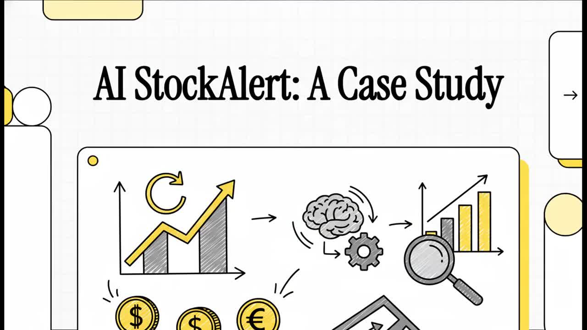](public/videos/AI-StockAlert-brief.mp4)

**Case study video** walking through the product strategy, competitive positioning, and technical decisions behind AI StockAlert — from problem definition through business model design.

## Slide Deck

| # | Slide | Message |
|---|-------|---------|
| 1 | 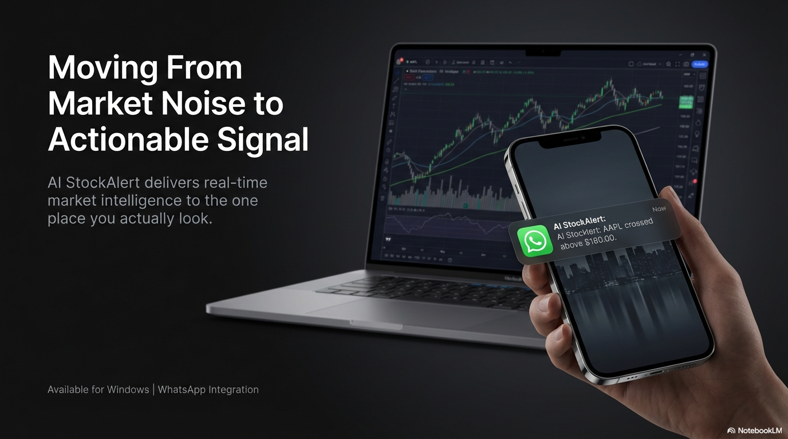 | **Moving From Market Noise to Actionable Signal.** Real-time intelligence delivered to WhatsApp. |
| 2 | 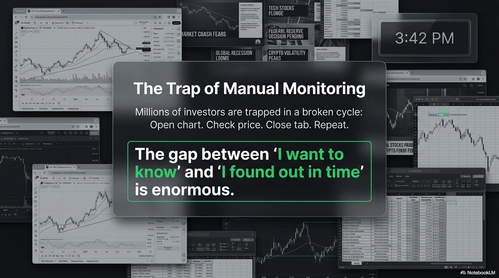 | **The Trap of Manual Monitoring.** Open chart. Check price. Close tab. Repeat. The gap between "I want to know" and "I found out in time" is enormous. |
| 3 | 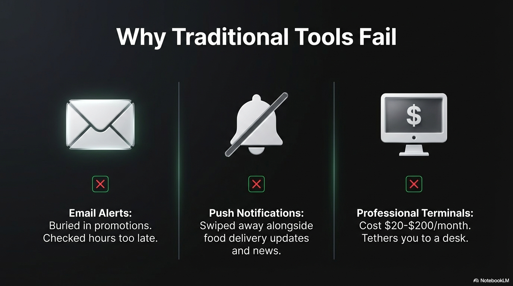 | **Why Traditional Tools Fail.** Email is buried. Push is swiped. Terminals cost $20-200/month. |
| 4 | 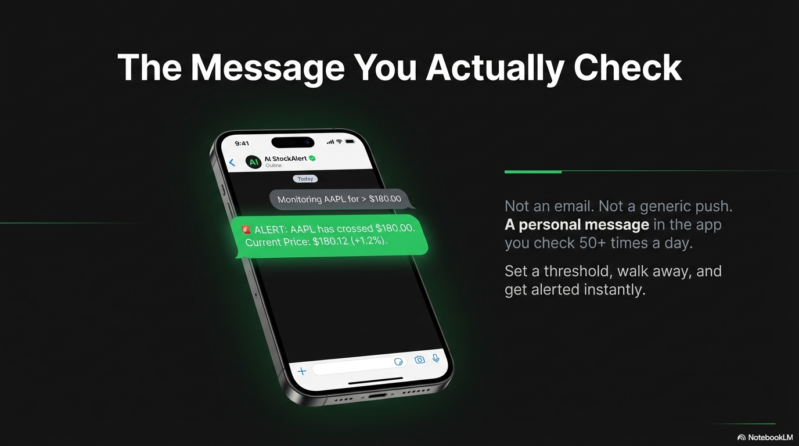 | **The Message You Actually Check.** A personal message in the app you check 50+ times a day. |
| 5 | 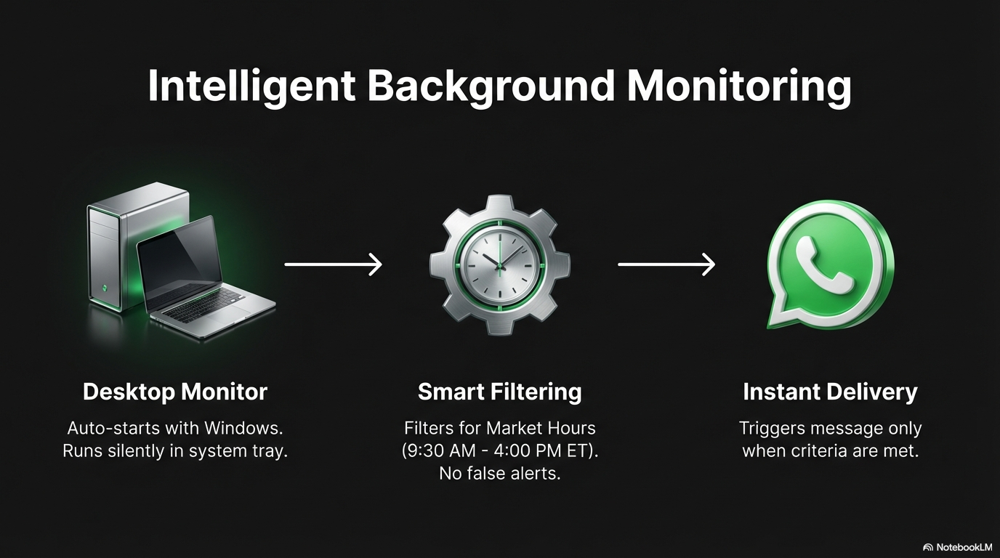 | **Intelligent Background Monitoring.** Auto-starts with Windows. Filters for market hours. Triggers on criteria. |
| 6 | 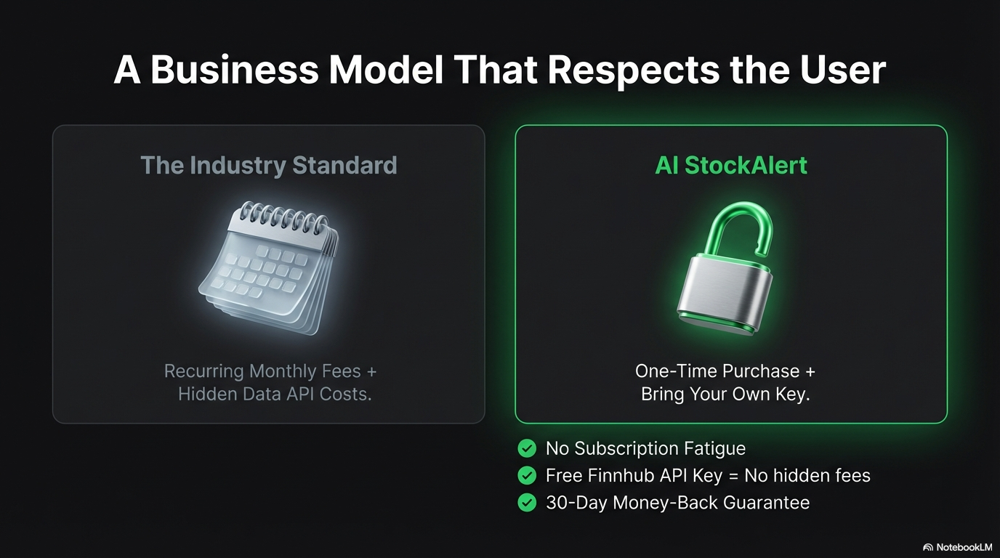 | **A Business Model That Respects the User.** One-time purchase + BYOK vs recurring fees + hidden costs. |
| 7 | 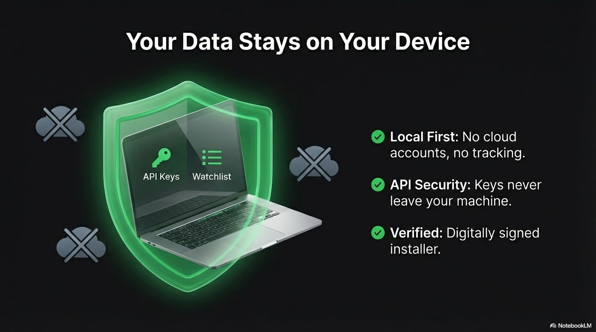 | **Your Data Stays on Your Device.** Local-first. No cloud accounts. Digitally signed. |
| 8 | 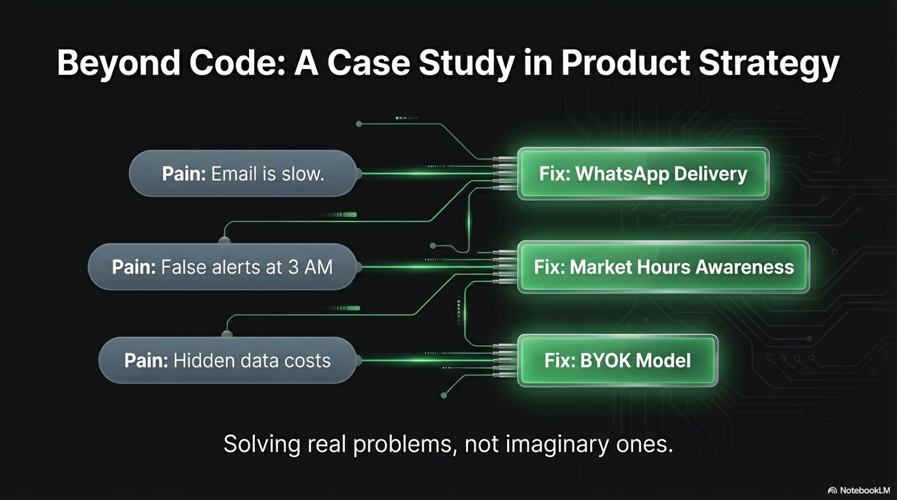 | **Beyond Code: Product Strategy.** Every feature maps to a real pain point, not an imaginary one. |
| 9 | 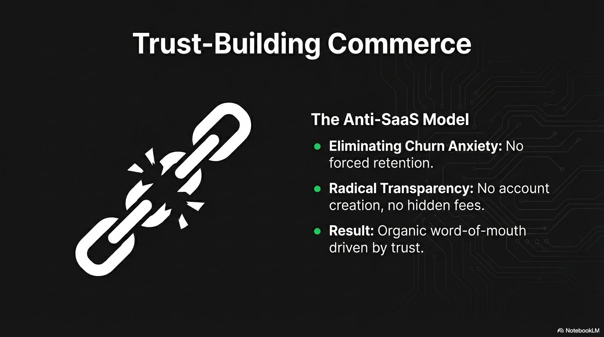 | **Trust-Building Commerce.** No churn anxiety. No forced retention. Organic growth through trust. |
| 10 | 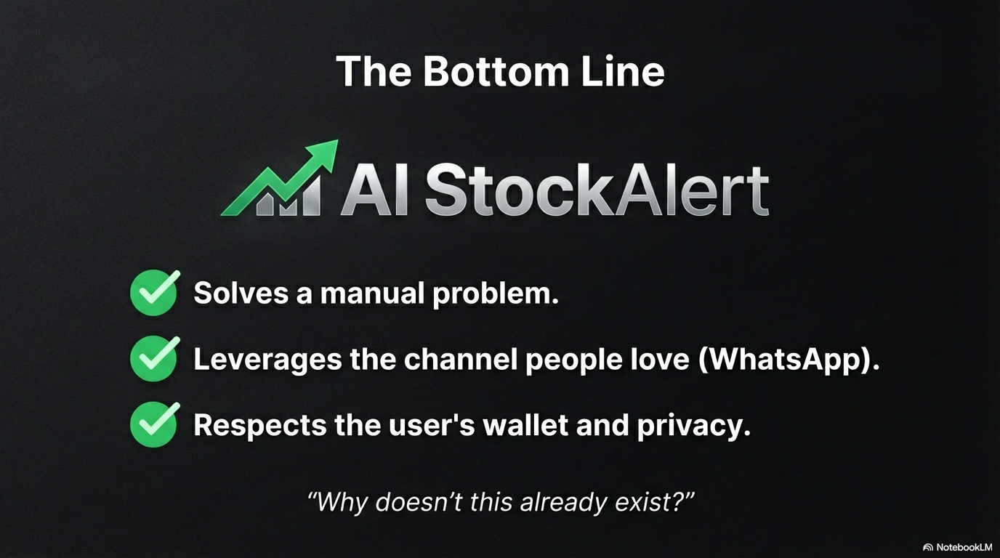 | **The Bottom Line.** Solves a manual problem. Leverages WhatsApp. Respects wallet and privacy. |
